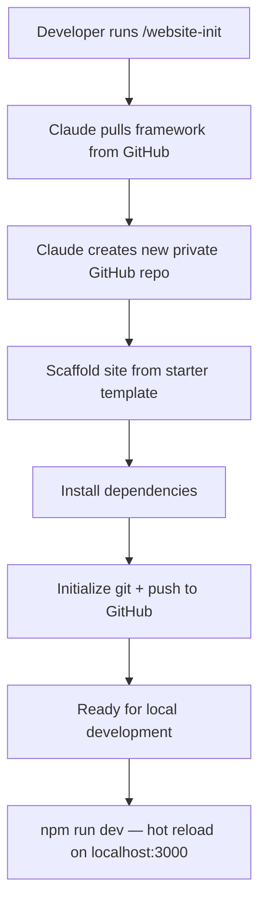
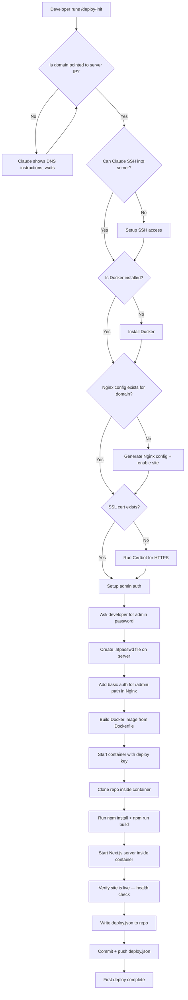
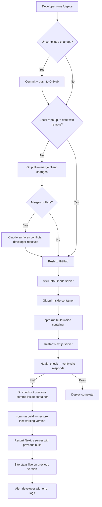
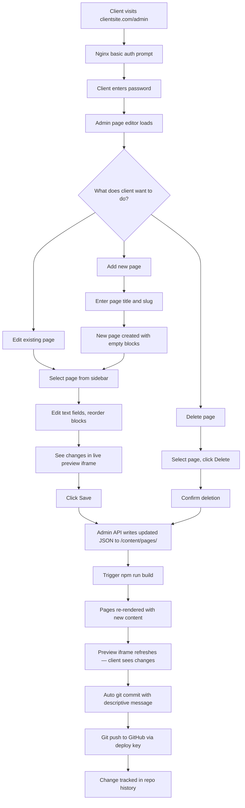
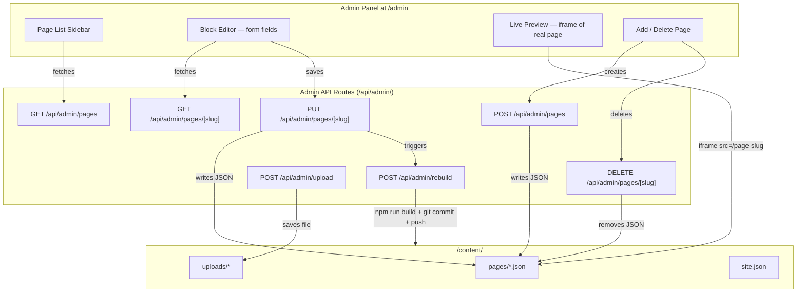
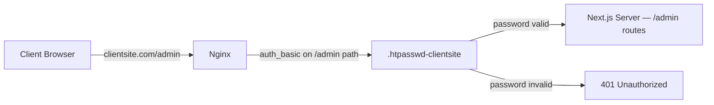
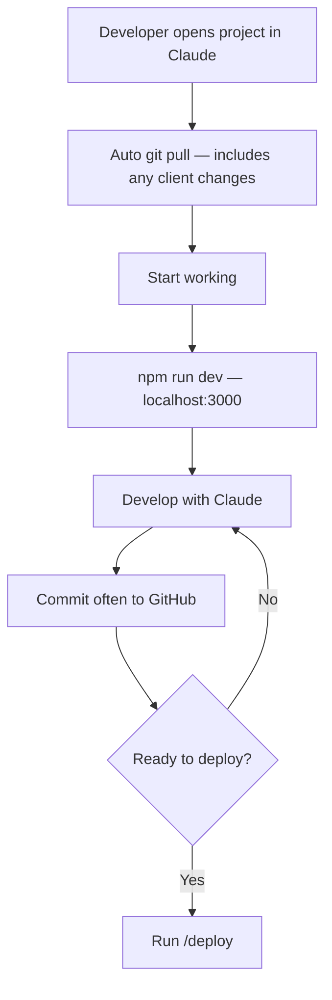
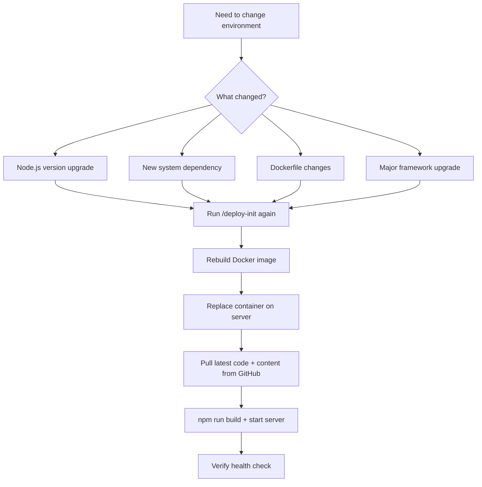
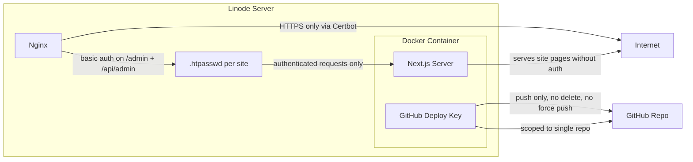

# Website Framework — Architecture

## System Overview

```mermaid
graph TB
    subgraph LOCAL["Developer Machine"]
        DEV[Developer + Claude]
        LOCAL_REPO[Local Git Repo]
        DEV -->|works on code| LOCAL_REPO
    end

    subgraph GH["GitHub (Private Repo)"]
        REMOTE_REPO[Remote Repository]
    end

    subgraph LINODE["Linode Ubuntu Server"]
        NGINX[Nginx Reverse Proxy + SSL + /admin Auth]
        subgraph DOCKER["Docker Container"]
            REPO[Git Repo Clone]
            NEXTJS["Next.js Server (site + admin)"]
            CONTENT[/content/ files]
            UPLOADS[/public/uploads/]
        end
    end

    subgraph CLIENT["Client Browser"]
        SITE_VIEW[Views Website]
        ADMIN_VIEW[Admin Panel at /admin]
    end

    LOCAL_REPO -->|git push| REMOTE_REPO
    REMOTE_REPO -->|git pull| REPO
    NEXTJS -->|serves pre-rendered pages| SITE_VIEW
    NEXTJS -->|serves admin panel + API| ADMIN_VIEW
    NGINX -->|reverse proxy all traffic| DOCKER
    NGINX -->|basic auth on /admin| ADMIN_VIEW
    CLIENT -->|clientsite.com| NGINX
    CLIENT -->|clientsite.com/admin| NGINX
    CONTENT -->|auto commit + push| REMOTE_REPO
```

### Key Architecture Decision: Server Mode

Next.js runs as a **server** in Docker, not as a static export. This is required because:
- The admin panel needs API routes to write content files and trigger rebuilds
- Pages are still **pre-rendered at build time** (ISR/SSG) — same performance as static
- One process serves both the site and the admin panel
- No separate API server needed

---

## Project Setup Flow (`/website-init`)



---

## First Deploy Flow (`/deploy-init`)



---

## Developer Deploy Flow (`/deploy`)



---

## Client Edit Flow (Admin Panel)



---

## Admin Panel — Page Editor Architecture



### Admin Panel UI Layout

```
┌─────────────────────────────────────────────────────┐
│  Site Name                              /admin      │
├────────────┬────────────────────────────────────────┤
│            │                                        │
│  Pages     │  Editing: About                        │
│            │                                        │
│  • Home    │  ┌─ Heading ─────────────────────┐     │
│  > About   │  │ About Me                      │     │
│  • Contact │  └───────────────────────────────┘     │
│            │  ┌─ Paragraph ───────────────────┐     │
│            │  │ I've been building websites... │     │
│  ──────    │  └───────────────────────────────┘     │
│  + Add     │  ┌─ Image ──────────────────────┐     │
│  Page      │  │ portrait.svg  [Change]        │     │
│            │  └───────────────────────────────┘     │
│            │                                        │
│            │  [Save]              [Preview ▸]       │
├────────────┴────────────────────────────────────────┤
│  Preview (iframe — shows real rendered page)        │
│  ┌────────────────────────────────────────────────┐ │
│  │                                                │ │
│  │        Actual site rendering of /about         │ │
│  │                                                │ │
│  └────────────────────────────────────────────────┘ │
└─────────────────────────────────────────────────────┘
```

### The Contract

The admin panel and the template are decoupled. They only share `/content/` files.

- **Admin panel** reads and writes content files via API routes — doesn't know or care about CSS frameworks or styling
- **Template** reads content files and renders them — any framework, any styles
- **Preview** is an iframe of the actual site — always accurate regardless of template

### Content File Format

```json
{
  "title": "About",
  "slug": "about",
  "blocks": [
    { "id": "b1", "type": "heading", "text": "About Me", "level": 1, "size": "display" },
    { "id": "b2", "type": "text", "body": "I design things…\n\nAnd I do it well." },
    { "id": "b3", "type": "image", "src": "/uploads/portrait.jpg", "alt": "Portrait" },
    { "id": "b4", "type": "grid", "heading": "Projects", "columns": 3, "items": [
      { "title": "Project A", "body": "Description" },
      { "title": "Project B", "body": "Description" }
    ]},
    { "id": "b5", "type": "button", "label": "Contact me", "href": "/contact", "variant": "primary" }
  ]
}
```

### Template Contract (only requirement)

Every template must implement a `BlockRenderer` that handles content block types:

```
BlockRenderer reads block.type → renders with template-specific styling
```

This means the admin panel works with any CSS framework (Tailwind, Bootstrap, vanilla CSS, etc.) because it never touches the rendering — it only edits the data.

---

## Admin Authentication — Nginx Basic Auth



### Nginx Config

```nginx
server {
    server_name clientsite.com;

    # All traffic proxied to Next.js
    location / {
        proxy_pass http://localhost:3001;
        proxy_set_header Host $host;
        proxy_set_header X-Real-IP $remote_addr;
    }

    # Admin path requires basic auth
    location /admin {
        auth_basic "Admin";
        auth_basic_user_file /etc/nginx/.htpasswd-clientsite;
        proxy_pass http://localhost:3001;
        proxy_set_header Host $host;
        proxy_set_header X-Real-IP $remote_addr;
    }

    # Admin API also requires auth
    location /api/admin {
        auth_basic "Admin";
        auth_basic_user_file /etc/nginx/.htpasswd-clientsite;
        proxy_pass http://localhost:3001;
        proxy_set_header Host $host;
        proxy_set_header X-Real-IP $remote_addr;
    }

    # SSL managed by Certbot
}
```

### Why Nginx Basic Auth

- Zero auth code in the framework
- Zero auth bugs — battle-tested
- Password change is one command on the server
- HTTPS via Certbot encrypts credentials in transit
- One less thing to build per site
- Works with any template

---

## Image Uploads

- Images uploaded through the admin panel are saved to `/public/uploads/`
- Referenced in content JSON as `/uploads/filename.jpg` (Next.js serves files in `/public/` at the root URL)
- Committed to git alongside content changes
- Suitable for small sites (< 10 images)
- For image-heavy sites, can be migrated to object storage per-site later

---

## Developer Starts Working (Daily Flow)



---

## Docker Image Rebuild (Rare)



---

## Starter Template — 3 Page Portfolio

```
/content/pages/
  home.json       ← hero, intro, featured work cards, tech badges
  about.json      ← bio, portrait, skills badges
  contact.json    ← contact cards, availability badges

/content/site.json ← site name, nav links, fonts, colors
```

---

## File Structure (Inside Each Site Repo)

```
site-repo/
├── app/                        # Next.js App Router
│   ├── layout.tsx              # Root layout — Header, Footer, site config
│   ├── page.tsx                # Home route — loads home.json
│   ├── not-found.tsx           # 404 page
│   ├── [slug]/
│   │   └── page.tsx            # Dynamic route — loads /content/pages/{slug}.json
│   ├── admin/
│   │   ├── page.tsx            # Admin panel — page editor UI
│   │   └── layout.tsx          # Admin layout (no site header/footer)
│   └── api/
│       └── admin/
│           ├── pages/
│           │   └── route.ts    # GET (list) / POST (create) pages
│           │   └── [slug]/
│           │       └── route.ts # GET / PUT / DELETE a page
│           ├── upload/
│           │   └── route.ts    # POST image upload
│           └── rebuild/
│               └── route.ts    # POST trigger rebuild + git commit/push
├── components/
│   ├── Header.tsx              # CSS Modules, no Tailwind
│   ├── Footer.tsx
│   ├── BlockRenderer.tsx       # Registry: merges framework + client blocks
│   ├── admin/
│   │   ├── BlockEditor.tsx     # Dispatcher: block.type → editor component
│   │   ├── BlockGallery.tsx    # "Add block" modal (manifests + client templates)
│   │   ├── PageSidebar.tsx
│   │   ├── PreviewPanel.tsx
│   │   ├── NavEditor.tsx
│   │   ├── SiteSettingsEditor.tsx
│   │   ├── manifests.ts        # Block templates with defaults
│   │   └── editors/            # One editor per block type
│   └── blocks/                 # The 10 base block render components
│       ├── HeadingBlock.tsx
│       ├── TextBlock.tsx
│       ├── ImageBlock.tsx
│       ├── ButtonBlock.tsx
│       ├── HeroBlock.tsx
│       ├── SectionBlock.tsx
│       ├── GridBlock.tsx
│       ├── TwoColumnBlock.tsx
│       ├── QuoteBlock.tsx
│       └── FormBlock.tsx
├── lib/
│   ├── ui/                     # 12 hand-rolled UI primitives + CSS Modules
│   │   ├── Container.tsx       # Display: Container, Stack, Heading, Text, Button
│   │   ├── TextField.tsx       # Form: TextField, TextAreaField, NumberField,
│   │   ├── ArrayField.tsx      #       SelectField, ToggleField, ImageField, ArrayField
│   │   └── ...
│   ├── content.ts              # loadPage(), loadSiteConfig(), listPages()
│   ├── types.ts                # Block, PageContent, SiteConfig types
│   ├── schemas.ts              # Zod schemas — validate admin saves
│   ├── themes.ts               # Theme preset loader
│   ├── motion.tsx              # Reveal / Stagger / Parallax (Framer Motion)
│   └── utils.ts                # cn() class joiner (no Tailwind merge)
├── content/
│   ├── pages/                  # JSON: home, about, contact
│   ├── themes/                 # 5 theme preset JSON files
│   ├── uploads/                # Client-uploaded images (< 10, committed to git)
│   └── site.json               # Site name, nav, fonts, theme preset
├── public/
│   └── images/                 # Static template assets
├── deploy.json                 # Deployment config (created by /deploy-init)
├── Dockerfile
├── next.config.ts
├── tsconfig.json
├── jest.config.ts
├── eslint.config.mjs
├── package.json                # 6 runtime deps: next, react, react-dom, lucide-react, motion, zod
└── README.md
```

---

## Security Model


